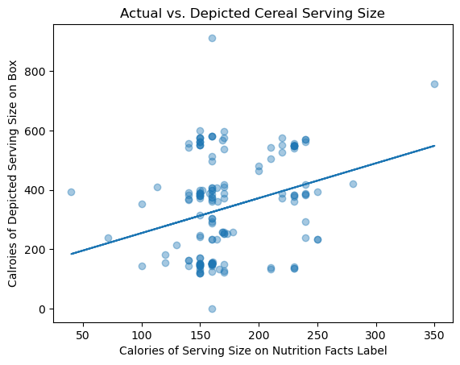

# Cap'n Crunch Can Eat A Bunch - But Should We?
Cereal serving sizes pictured on the box have almost twice as many calories as the serving size suggested on the nutrition facts label, I found during my internship at the Cornell Food and Brand Lab followed by an independent research study I conducted as a student at Dickinson College. This was long before I knew that I loved programming or that machine learning algorithms can produce linear regression models.

In this notebook, I load the dataset based on my own hands-on research (yes, cereal was a major food source during this time). I implement a linear regression machine learning model with sklearn to show the relationship between depicted vs. suggested serving size:

The study is part of a research article that I co-authored. It has been published in the <a href="https://pubmed.ncbi.nlm.nih.gov/28166756//">BMC Public Health Journal</a>.